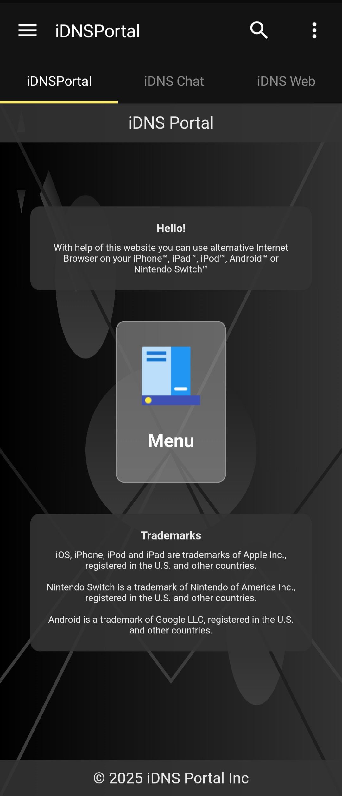

# 📱 iDNS Portal Android App

An **unofficial Android app** for **[iDNS Portal](https://idnsportal.com/)**, built with **Lua + WebView**.  
Provides a seamless experience for accessing **iDNS Portal** on Android devices.

## 🚀 Features
- 🌐 **Mainly WebView** – Enjoy the iDNS Portal just like on a browser.
- ⚡ **Lightweight & Fast** – Application resources are small, and the installation package is only 2MB.
- 🎨 **Simple & Clean UI** – No extra features, just what you need.

## ⚠️ Compatibility Notice

- 📱 **Minimum SDK Version:** `21` (Android 5.0 Lollipop)  
- 🎯 **Target SDK Version:** `26` (Android 8.0 Oreo)  
- 🚫 **Not optimized for newer Android versions** – Some features may not work correctly on Android 10+.

## 📥 Download
👉 [Download APK](https://github.com/iMallpa/iDNSPortal/releases/) and install on your device.

## 🖼️ Screenshots
Here’s a preview of the app in action:

## ⚠️ Disclaimer
This app is **not affiliated** with **iDNS Portal** or its original developers.  
It is an independent project for better mobile access.

---
Made with ❤️ by Felix Brown
